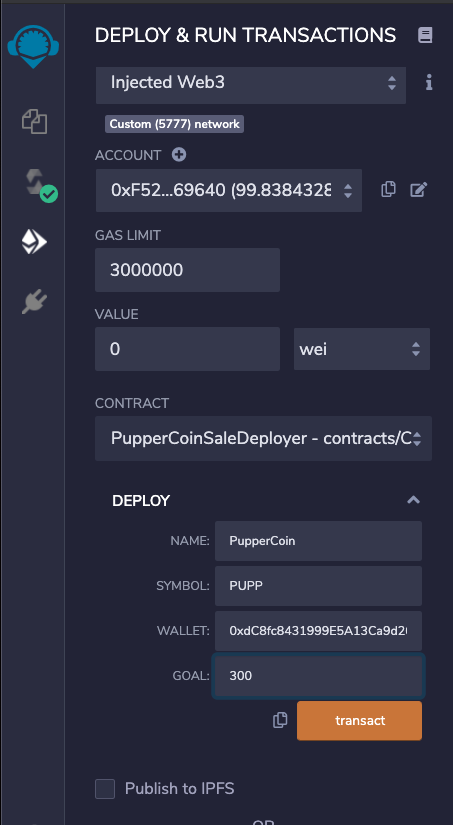
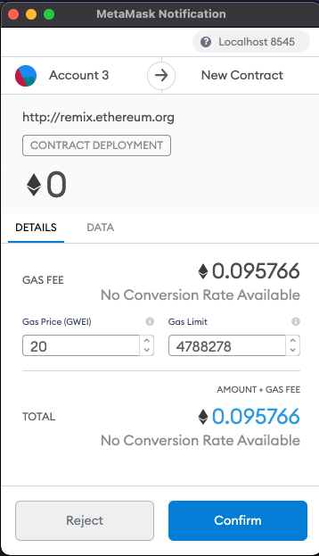
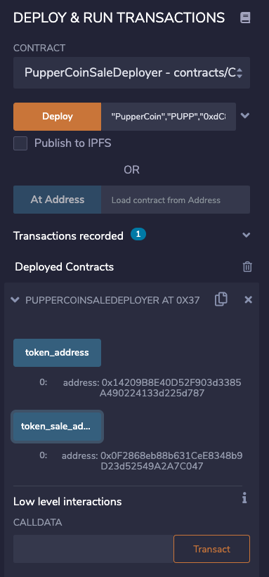
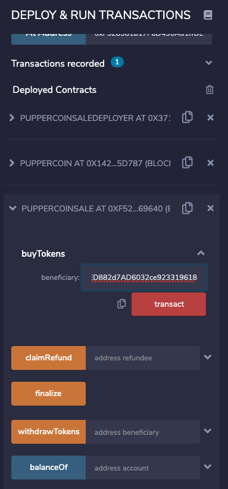
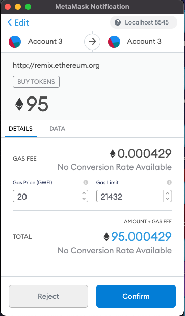

# PupperCoin

## Summary

PupperCoin is a token that will be minted through a Crowdsale contract leveraging the OpenZeppelin Solidity library. This crowdsale contract will manage the entire process, allowing users to send ETH and get back PUPP (PupperCoin).

This contract will mint the tokens automatically and distribute them to buyers in one transaction.
Utilizing the Remix IDE, create a file called PupperCoin.sol and create and create a standard ERC20Mintable token.
Create a new contract named PupperCoinCrowdsale.sol, and prepare it like a standard crowdsale.

Inherit the following OpenZeppelin library contracts:

* Crowdsale
* MintedCrowdsale
* CappedCrowdsale
* TimedCrowdsale
* RefundablePostDeliveryCrowdsale

### Follow these steps to deploy, run, and transact the contract.

